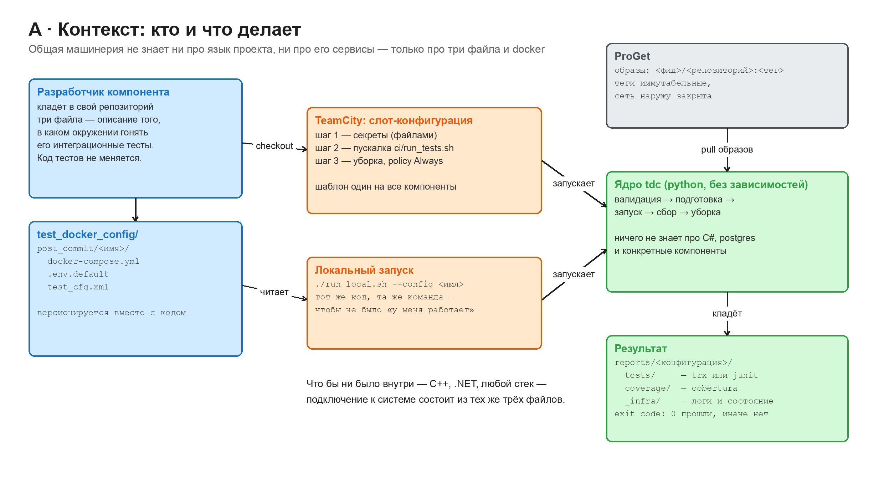
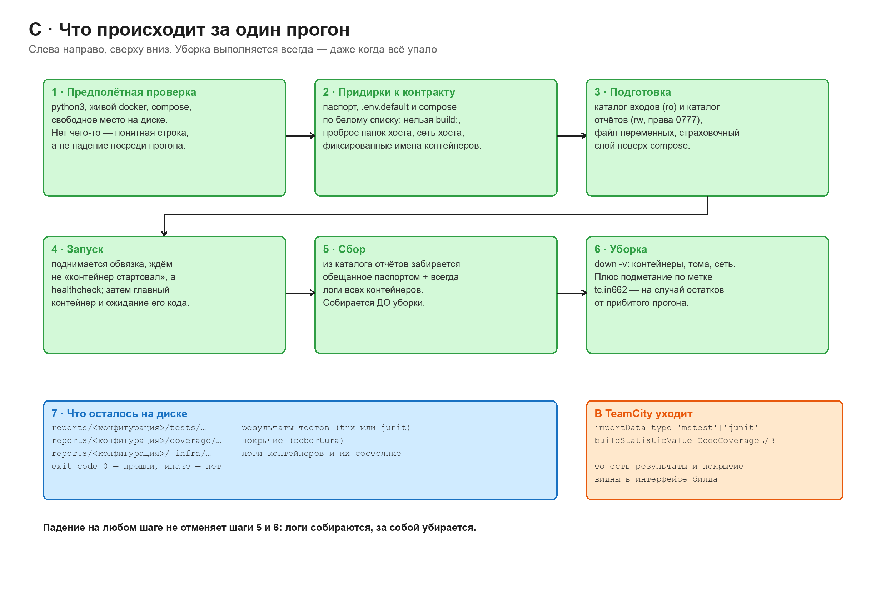
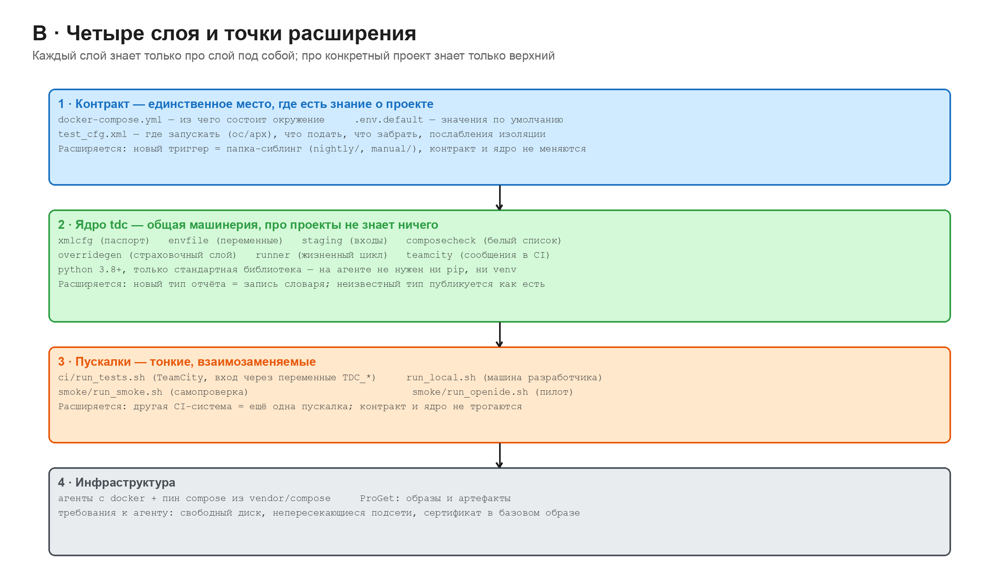
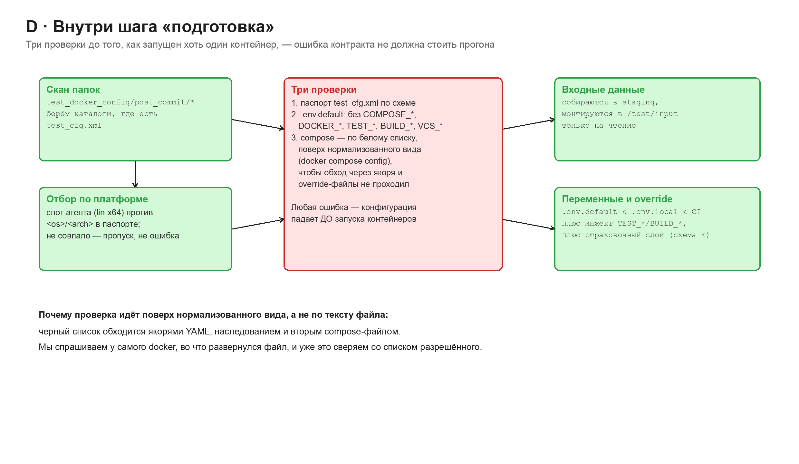
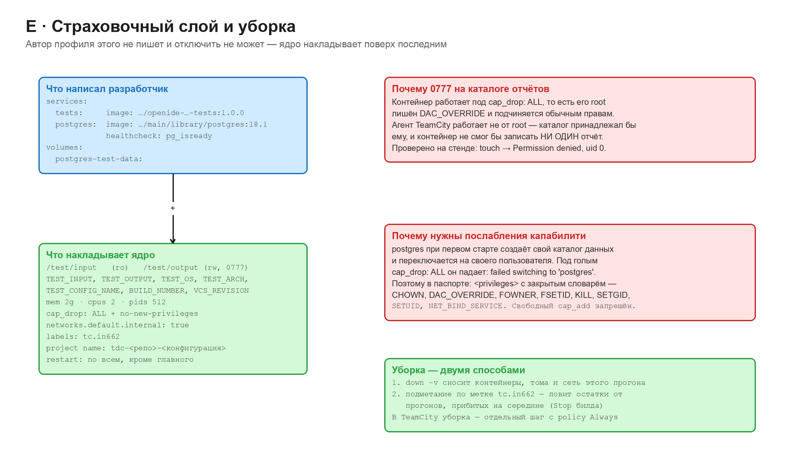
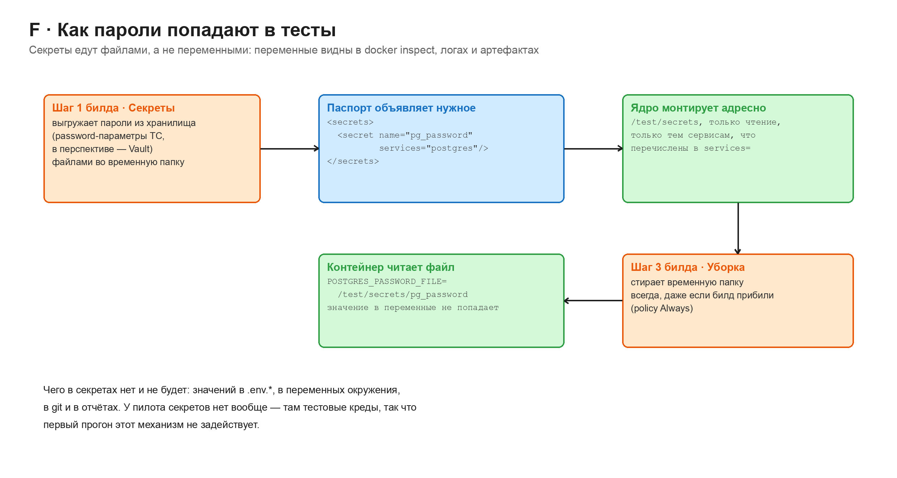

# IN-662 · Запуск автотестов в окружении, заданном разработчиком

> **Кому что читать.** Разработчику компонента нужен [HOWTO.md](HOWTO.md):
> четыре шага и готовые примеры для .NET и C++, без устройства системы.
> Этот документ про устройство и обоснования решений. Он для тех, кто
> принимает по нему решения.

**Коротко.** Разработчик кладёт в свой репозиторий три файла. Это описание окружения,
в котором надо гонять его интеграционные тесты. Дальше всё делает общая машинерия,
одинаковая для всех проектов: поднимает окружение, запускает тесты, забирает
результаты, убирает за собой. Про язык проекта и его сервисы она не знает ничего.

Решение реализовано и проверено на настоящем пилоте: интеграционные тесты
`SCADA/elara_openide_backend` прошли через него на dev-стенде без единой правки
их кода.

---

## 1. Зачем

Возьмём то, как это устроено у пилота сегодня. Картина типичная.

Тесты запускаются **руками**, на машине разработчика под Windows, по инструкции
в Confluence. Перед запуском нужно: поставить Docker Desktop, скопировать
`.env.example` в `.env`, вручную экспортировать корневой сертификат прокси из
оснастки MMC в корень решения, и поправить подсети в настройках Docker Engine,
потому что дефолтные пересекаются с офисной сетью. Четыре ручных шага, каждый
из которых ломается молча. Сертификат протухает, и сборка перестаёт работать
у всех сразу. Никто не понимает почему.

Но главное не это. **На выходе нет ничего.** Команда запуска такая:
`dotnet test --filter … --no-build`. Она идёт без ключей выгрузки отчётов, а
томов под них в compose нет. Результаты остаются внутри контейнера и умирают вместе с
ним. Единственный сигнал: код возврата. По упавшему прогону нельзя сказать,
какой тест упал.

И запускается это только вручную: в CI такой конфигурации нет вообще.

Задача: сделать так, чтобы любой компонент мог описать своё окружение один раз,
а запуск, сбор результатов и уборка достались ему готовыми.

---

## 2. Идея: три файла

В репозитории компонента появляется каталог:

```
test_docker_config/post_commit/<имя набора>/
    docker-compose.yml    из чего состоит окружение
    .env.default          значения по умолчанию (без секретов)
    test_cfg.xml          паспорт: где запускать, что подать, что забрать
```

Всё. Код тестов не меняется, Dockerfile не меняется, зависимости не добавляются.

У пилота этот каталог описывает два контейнера, базу и контейнер с тестами, и
занимает около шестидесяти строк.



---

## 3. Как проходит один прогон



Пояснения к шагам, которые обычно вызывают вопросы:

**Шаг 2, «придирки».** Compose проверяется не по тексту файла, а по тому, во что
он развернулся: мы спрашиваем у самого docker (`docker compose config`) и
сверяем результат с белым списком разрешённого. Иначе запрет обходится якорями
YAML, наследованием и вторым compose-файлом.

**Шаг 4, «запуск».** Ждём не «контейнер стартовал», а готовность по healthcheck.
Разница принципиальная: база отвечает на соединения на несколько секунд позже,
чем поднимается её контейнер.

**Шаг 5, «сбор».** Логи и состояние контейнеров собираются **всегда**. И когда
всё прошло, и когда упало. Обязательно до уборки, иначе разбирать падение было
бы нечем.

**Шаг 6, «уборка».** Двумя способами: `down -v` сносит всё, что относится к
этому прогону, а отдельное подметание по метке `tc.in662` ловит остатки от
прогонов, которые прибили на середине. На общем агенте один забытый том ломает
следующий билд.

---

## 4. Слои: что от чего зависит



Смысл разделения в том, где именно находится знание о конкретном проекте: **только
в верхнем слое**. Ядро не знает про C#, postgres и OpenIde. Пускалка не знает про
проекты. Шаблон TeamCity не содержит ни одного имени компонента.

Отсюда следует, как расширять систему, не трогая общий код:

| Что добавляем | Что для этого нужно |
|---|---|
| Новый компонент | три файла в его репозитории |
| Новый класс запусков (nightly, ручной) | папка-сиблинг рядом с `post_commit/` |
| Новая ОС или архитектура | запись в словаре слотов + конфигурация из шаблона |
| Новый тип отчёта | запись в словаре; неизвестный тип и так публикуется как артефакт |
| Другая CI-система | ещё одна пускалка, контракт и ядро не трогаются |

---

## 5. Что проверяется до запуска



Три проверки происходят до того, как запущен хоть один контейнер: ошибка в
контракте не должна стоить прогона. Проверяются паспорт, имена переменных
(зарезервированные префиксы запрещены) и compose по белому списку.

Что запрещено в compose и почему:

| Запрет | Причина |
|---|---|
| `build:` | тест-агент не должен собирать образы и получать исходники |
| проброс папок хоста | доступ к файловой системе агента |
| `docker.sock` | доступ к демону = права root на агенте, см. §9 |
| `privileged`, `cap_add`, `devices` | обход изоляции |
| сеть/PID/IPC хоста | выход за пределы контейнера |
| `ports:` | занятие портов агента, конфликты между билдами |
| `container_name:` | конфликт при параллельных прогонах |
| `restart: always` | вечный рестарт упавшей базы под тестовым прогоном |
| образы не из внутреннего registry, теги `latest` | невоспроизводимость |

---

## 6. Изоляция и уборка



Поверх пользовательского compose ядро накладывает слой, который автор профиля не
пишет и отключить не может. Два решения в нём заслуживают отдельного объяснения,
потому что оба были найдены не на бумаге, а на реальном прогоне.

**Права 0777 на каталоге отчётов.** Контейнер работает с полностью снятыми
привилегиями, то есть его root подчиняется обычным правам доступа. Агент
TeamCity работает не от root: значит каталог отчётов принадлежал бы служебному
пользователю, и контейнер не смог бы записать туда **ни одного файла**.
Проверено прямой пробой на стенде: `touch` → `Permission denied` при uid 0.
Без этой правки на первом же настоящем билде терялись бы все отчёты, а
конфигурация падала бы с невнятным «отчётов не найдено».

**Управляемое ослабление привилегий.** База при первом старте создаёт свой
каталог данных и переключается на своего пользователя: под полностью снятыми
привилегиями она просто не стартует. Поэтому в паспорте есть блок `<privileges>`
с **закрытым словарём**: проект может попросить назад несколько конкретных
капабилити, но не может написать произвольный `cap_add` в compose. Список виден
в ревью и одинаков для всех.

---

## 7. Секреты



Секреты едут **файлами, а не переменными**: переменные видны в `docker inspect`,
попадают в логи и в артефакты сборки. Отдельный шаг билда выкладывает пароли во
временную папку, ядро монтирует её только на чтение и только тем сервисам,
которые перечислены в манифесте, контейнер читает значение из файла, финальная
уборка папку стирает: всегда, даже если билд прибили.

Механизм реализован и проверен. У пилота секретов нет, там тестовые креды,
поэтому первый прогон его не задействует.

---

## 8. Что уже проверено

Не «спроектировано», а прогнано.

**Настоящие интеграционные тесты OpenIde на dev-стенде** (Astra 1.8, docker
28.3.3, python 3.11.2), одной командой:

- тестовый образ собран из их же `postgres.Dockerfile` на внутреннем
  `dotnet:0.5.0` и внутреннем NuGet-фиде: `Build succeeded, 0 Error(s)`;
- обвязка поднялась на `postgres:18.1` из ProGet под снятыми привилегиями;
- прошли все семь тестов набора, код возврата 0;
- собраны `integration.trx` и `coverage.cobertura.xml`, в TeamCity ушли
  `importData` и цифры покрытия;
- после прогона на агенте не осталось ни контейнеров, ни томов.

**Правки их репозитория: ноль.** Всё изменение это три файла профиля. `build:`
заменён на готовый образ, убраны `container_name` и `restart: always`, к команде
запуска добавлены три ключа выгрузки отчётов.

Дорога до зелёного дала восемь дефектов. Каждый выстрелил бы на первом
настоящем билде и выглядел бы как «тесты сломались»:

| Что нашли | Чем грозило |
|---|---|
| контейнер не мог писать в каталог отчётов | на агенте терялись бы все отчёты |
| база не стартовала под снятыми привилегиями | набор с базой не запускался бы вообще |
| на агентах нет плагина compose | не запустилось бы ничего |
| VSTest пишет отчёт о покрытии дважды | цифры покрытия удваивались |
| каталог отчётов не чистился между прогонами | счётчики складывались, упавший прогон рапортовал чужие цифры |
| сообщение о падении не называло причину | разбор каждой поломки вслепую |
| исчерпание диска выглядело как падение тестов | часы поисков не там |
| цель `dotnet test` бралась из рабочего каталога | результат зависел от содержимого образа |

Все восемь найдены прогоном, а не разбором кода.

---

## 9. Границы

**Что в первом этапе.** Linux-слоты, класс `post_commit`, отчёты о тестах и
покрытии, один пилотный компонент.

**Что отложено осознанно:**

- **Windows**: этап 2. Пути в контейнерах уже переменные, пускалка потребует
  ps1-близнеца, нужны win-агенты с docker.
- **arm/arm64**: механика готова, нужны образы под эти архитектуры в ProGet.
- **Доступ к docker-сокету.** Второй набор тестов пилота создаёт контейнеры
  программно, через клиент Docker API. Такие контейнеры не принадлежат нашему
  прогону. `down -v` их не видит, метки на них нет, подметание не найдёт,
  и агент течёт. В первом этапе такие наборы не поддерживаются. Дальнейший путь:
  фильтрующий прокси к сокету плюс требование к проекту помечать порождаемые
  контейнеры нашей меткой; вариант с вложенным docker отложен, так как требует
  привилегированного контейнера на агенте.
- **Адресная выдача входных данных** отдельным сервисам: в контракте описана,
  в ядре пока монтируется всем; на пилот не влияет, входов у него нет.

---

## 10. Что нужно от других

| Кому | Что |
|---|---|
| Лид | где IN-662 живёт на TeamCity; входит ли Windows в первый этап |
| Команда OpenIde | согласие на пилот; переход от `build:` к готовому образу; что именно поднимает их web-набор через Docker API |
| ProGet (самообслуживание) | имя фида для тестовых образов, иммутабельность тегов, доступ агентов на чтение |
| Требования к агентам | свободное место на диске, непересекающиеся подсети docker, корневой сертификат прокси слоем базового образа, а не файлом в репозитории |

---

## 11. Как это пощупать

Всё лежит в `tdc-runner`; ставить ничего не нужно, compose едет в самом
репозитории.

```sh
python3 -m unittest discover -s tests    # проверка ядра, контейнеры не поднимаются
./smoke/run_smoke.sh                     # сквозной прогон на заглушке
./smoke/run_smoke.sh --negative          # проверка, что защита работает
./run_local.sh <набор> --repo <репо>     # как запускает разработчик
./smoke/run_as_ci.sh <репо>              # как запустит TeamCity
```

Результат каждого прогона: каталог `reports/<конфигурация>/` с результатами
тестов, покрытием и логами контейнеров, плюс код возврата.

---

*Схемы редактируемые: рядом с каждым `.png` лежит `.excalidraw` с тем же именем.*
