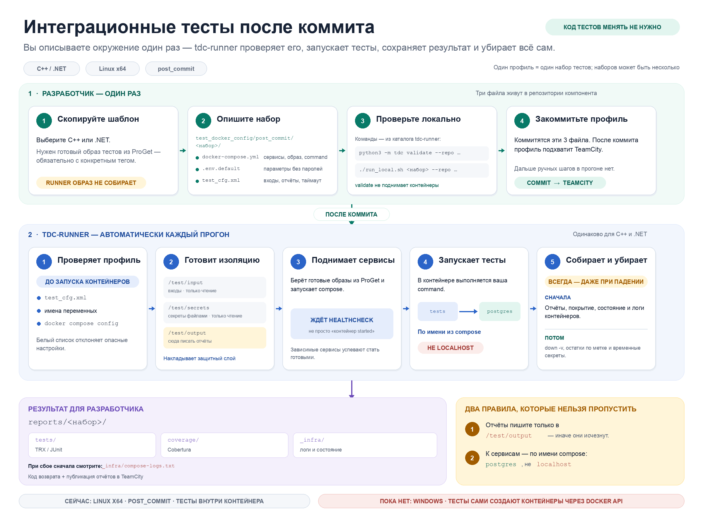

# Интеграционные тесты в Docker

Кладёте в репозиторий три файла. Дальше запуск, сбор отчётов и уборка
происходят сами. Код тестов не трогаем.



## Подходит ли вам

| Что | Ответ |
|---|---|
| ОС и архитектура контейнеров | Linux x64 |
| Тесты работают внутри контейнера | да |
| Тесты сами создают контейнеры (Testcontainers, Docker API) | нет |
| Windows, arm | позже |

## Три команды

```sh
git clone <адрес tdc-runner> && cd tdc-runner

cp -r templates/dotnet/test_docker_config <ваш репозиторий>/   # или cpp
# правите места, помеченные словом ЗАМЕНИТЬ

./run_local.sh integration --repo <ваш репозиторий>
```

Нужны только `docker` и `python3`. Это тот же код, что запустит сервер:
прошло у вас, пройдёт и там.

Посмотреть весь путь целиком, ничего не настраивая:
`./smoke/demo_from_template.sh`.

## Что заменить в шаблоне

| Файл | Что |
|---|---|
| `docker-compose.yml`, `image:` | ваш образ в ProGet с конкретным тегом |
| `docker-compose.yml`, `command:` | путь к тест-проекту (.NET) или имя бинарника (C++) |
| `docker-compose.yml`, `--filter` | как помечены ваши интеграционные тесты |
| `test_cfg.xml`, `<description>` | одна строка про набор |
| `test_cfg.xml`, `<timeout_minutes>` | если тесты идут дольше 20 минут |
| `test_cfg.xml`, `<inputs>` | какие файлы сборки положить внутрь (C++) |

Образ с тестами собирает отдельная конфигурация сборки. Как это устроить для
вашего компонента, спросите у нас.

## Два правила

**Отчёты пишите в `/test/output`.** Только этот каталог переживёт контейнер.
В шаблонах нужные ключи уже стоят.

**К соседям обращайтесь по имени сервиса из compose, не по `localhost`.**
Рядом база с именем `postgres`, значит хост будет `postgres`.

Из-за этих двух правил, возможно, придётся поправить настройки тестов. Сам код
тестов не меняется.

## Результат

```
<ваш репозиторий>/.tdc-out/reports/<набор>/
    tests/      результаты тестов
    coverage/   покрытие
    _infra/     логи контейнеров
```

Добавьте `.tdc-out/` в `.gitignore`. Каталог пересоздаётся при каждом запуске.
Упало: открывайте `_infra/compose-logs.txt`, он пишется всегда.

## Требования к тестам

1. Отчёты в `/test/output`, путь есть в переменной `TEST_OUTPUT`.
2. Адрес соседнего сервиса берётся из переменной окружения, не из кода.
   Частая засада: в конфиге тестов значение по умолчанию `localhost`.
3. База поднимается пустой при каждом запуске. Схему создают сами тесты,
   порядок тестов не гарантирован.
4. Тесты не создают контейнеры сами.
5. Интеграционные тесты помечены категорией, иначе фильтр возьмёт все подряд.
6. Наружу в интернет хода нет, портов наружу тоже.

Переменные внутри контейнера: `TEST_OUTPUT`, `TEST_INPUT`, `TEST_OS`,
`TEST_ARCH`, `TEST_CONFIG_NAME`, `BUILD_NUMBER`, `VCS_REVISION`.

## Частые ошибки

| Сообщение | Что делать |
|---|---|
| `набор ... не найден` | опечатка в имени, ниже список доступных |
| `permission denied ... docker.sock` | вы не в группе `docker`: либо `sudo`, либо `usermod -aG docker $USER` |
| `compose.build_forbidden` | уберите `build:`, образ берётся готовым из ProGet |
| `compose.image_tag` | поставьте конкретный тег вместо `latest` |
| `compose.container_name_forbidden`, `compose.restart_forbidden` | уберите эти строки |
| `compose.bind_mount` | уберите проброс папок с хоста, файлы подавайте через `<inputs>` |
| `env.reserved_prefix` | заняты `TEST_*`, `BUILD_*`, `VCS_*`, `COMPOSE_*`, `DOCKER_*` |
| `reports.zero_matches` | отчёт не попал в `/test/output` либо путь в манифесте не совпал |
| `failed switching to 'postgres'` | базе не хватает прав, см. рецепт ниже |
| `No space left on device` | на машине кончилось место |

## Рецепты

**База рядом.** У базы `healthcheck`, у тестов `depends_on` с
`condition: service_healthy`. Плюс в `test_cfg.xml`, иначе база не стартует под
снятыми правами:

```xml
  <privileges>
    <service name="postgres" cap_add="CHOWN DAC_OVERRIDE FOWNER SETGID SETUID"/>
  </privileges>
```

В compose `cap_add` запрещён: там можно попросить что угодно. В манифесте
список закрытый, восемь прав.

**Пароли.** В `.env.default` нельзя, файл в git.

```xml
  <secrets>
    <secret name="db_password" services="postgres"/>
  </secrets>
```

Приедет файлом в `/test/secrets/db_password`, только на чтение и только
перечисленным сервисам. Локально: ключ `--secrets <каталог>`. Объявили секрет,
а файла нет: прогон не начнётся.

**Файлы снаружи.** По умолчанию внутрь не попадает ничего.

```xml
  <inputs>
    <artifact path="build/tests/**" dest="bin/"/>
    <source path="tests/data/**" dest="data/"/>
  </inputs>
```

Путь сохраняется от первой статической части маски: для `build/tests/**` файлы
лягут прямо в `/test/input/bin`. Каталог артефактов: ключ `--artifacts`.

**Локальные значения.** `.env.local` рядом с `.env.default`, перекрывает его,
читается только локально, в git не коммитится.

## Что запрещено в compose

`build:`, проброс папок с хоста, `ports:`, `container_name`, `restart`,
`privileged`, `cap_add`, сеть и PID хоста, образы не из ProGet, тег `latest`.
Проверяется до запуска контейнеров.

## Ещё не решено

Конфигурация в TeamCity настраивается, пока набор запускается вручную. Фид
ProGet для образов согласуется. Windows и arm позже.

Вопросы: `<канал, чат или почта: заполнить>`.
